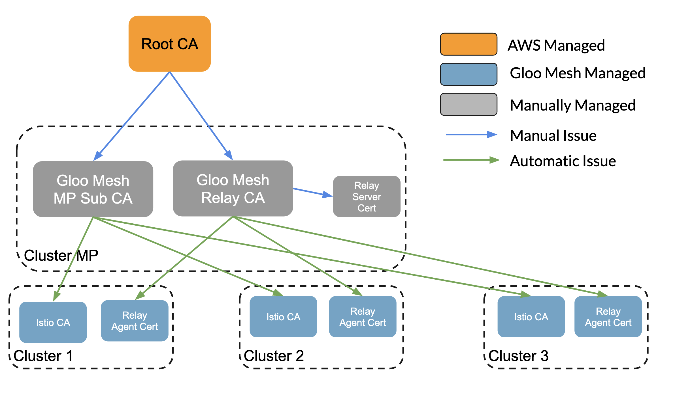

# ACM Managed Root CAs

This is a hybrid approach where the Root CA is generated and managed by AWS ACM. We still utilize Gloo Mesh to issue Istio CA Intermediate Certificates but with the external Root CA it is easier to rotate the Gloo Mesh Issuing CA Certificate down the line. If you use ACM it is acceptable for the relay agents and Istio CAs to share the same root certificate. 

## Using ACM for Root CA Only
This method generates two Intermediate certificates to be used by Gloo Mesh, one for Istio CA Certificate Issuance and one for Gloo Mesh Relay Agents.



## Using ACM for Root CA and Relay SubCA

This method is a hybrid approach. Both the Root CA and Relay Intermediate CA are stored within ACM.

Creating a RootCA Certificate can be followed here https://docs.aws.amazon.com/acm-pca/latest/userguide/PcaCreateCa.html


```sh
###########################################################
# Gloo Mesh Root CA (stored in AWS ACM)
###########################################################
echo '''
{
   "KeyAlgorithm":"RSA_2048",
   "SigningAlgorithm":"SHA256WITHRSA",
   "Subject":{
      "OrganizationalUnit":"Demo",
      "CommonName":"Gloo Mesh Root CA"
   }
}
''' > ca_config.json
CREATE_CA_RESPONSE=$(aws acm-pca create-certificate-authority \
     --certificate-authority-configuration file://ca_config.json \
     --certificate-authority-type "ROOT" \
     --idempotency-token 01234567 \
     --tags  Key=Name,Value=Gloo-Mesh-RootCA| jq -r '.CertificateAuthorityArn')
# Response
# {
#   "CertificateAuthorityArn": "arn:aws:acm-pca:us-east-1:123456789:certificate-authority/123456789-debf-4513-89f7-c1834d5ffbd5"
# }

CAARN=$CREATE_CA_RESPONSE

# download Root CA CSR from AWS
aws acm-pca get-certificate-authority-csr \
    --certificate-authority-arn $CAARN \
    --output text > root-ca.csr

# Issue Root Certificate
ISSUE_CERTIFICATE_RESPONSE=$(aws acm-pca issue-certificate \
    --certificate-authority-arn $CAARN \
    --csr fileb://root-ca.csr \
    --signing-algorithm "SHA256WITHRSA" \
    --template-arn arn:aws:acm-pca:::template/RootCACertificate/V1 \
    --validity Value=3650,Type="DAYS" \
    --idempotency-token 1234567 \
    --output json | jq -r '.CertificateArn')

CERTARN=$ISSUE_CERTIFICATE_RESPONSE

# Download Certificate
aws acm-pca get-certificate \
    --certificate-authority-arn $CAARN \
    --certificate-arn $CERTARN \
    --output text > root-ca.pem

# Upload certificate to AWS
aws acm-pca import-certificate-authority-certificate \
    --certificate-authority-arn $CAARN \
    --certificate fileb://root-ca.pem

###########################################################
# Gloo Mesh Intermediate CA for Istio
# Generated locally but signed by Gloo Mesh Root CA
###########################################################

# Generate Intermediate CA Certificate Request
cat > "gloo-mesh-intermediate.conf" <<EOF
[req]
req_extensions = v3_req
distinguished_name = req_distinguished_name
[req_distinguished_name]
[ v3_req ]
basicConstraints = critical,CA:TRUE
keyUsage = digitalSignature, keyEncipherment, keyCertSign
extendedKeyUsage = clientAuth, serverAuth
subjectAltName = @alt_names
[alt_names]
DNS = *.gloo-mesh
EOF

openssl genrsa -out gloo-mesh-intermediate.key 2048
openssl req -new -sha256 -key gloo-mesh-intermediate.key -config gloo-mesh-intermediate.conf -out gloo-mesh-intermediate.csr -subj "/CN=gloo-mesh-ca"

# Sign Gloo Mesh Intermediate Certificate
ISSUE_CERTIFICATE_RESPONSE=$(aws acm-pca issue-certificate \
    --certificate-authority-arn $CAARN \
    --csr fileb://gloo-mesh-intermediate.csr \
    --signing-algorithm "SHA256WITHRSA" \
    --template-arn arn:aws:acm-pca:::template/SubordinateCACertificate_PathLen0/V1 \
    --validity Value=365,Type="DAYS" \
    --idempotency-token 1234567 \
    --output json | jq -r '.CertificateArn')

INT_CAARN=$ISSUE_CERTIFICATE_RESPONSE

# Download the Gloo Mesh Intermediate Certificate
aws acm-pca get-certificate \
    --certificate-authority-arn $CAARN \
    --certificate-arn $INT_CAARN \
    --output text > gloo-mesh-intermediate.pem

###########################################################
# Relay Intermediate Certificate
# Generated and Managed By ACM, signed by Gloo Mesh Root CA
###########################################################
echo '''
{
   "KeyAlgorithm":"RSA_2048",
   "SigningAlgorithm":"SHA256WITHRSA",
   "Subject":{
      "Country":"US",
      "Organization":"Solo.io",
      "OrganizationalUnit":"Demo",
      "State":"MA",
      "Locality":"Boson",
      "CommonName":"Relay Intermediate CA"
   }
}
''' > relay_int_config.json
CREATE_CA_RESPONSE=$(aws acm-pca create-certificate-authority \
     --certificate-authority-configuration file://relay_int_config.json \
     --certificate-authority-type "SUBORDINATE" \
     --idempotency-token 01234567 \
     --tags  Key=Name,Value=Gloo-Mesh-RootCA| jq -r '.CertificateAuthorityArn')

REALY_CAARN=$CREATE_CA_RESPONSE

# download Relay CA CSR from AWS
aws acm-pca get-certificate-authority-csr \
    --certificate-authority-arn $REALY_CAARN \
    --output text > relay-int-ca.csr

# Issue Root Certificate
ISSUE_CERTIFICATE_RESPONSE=$(aws acm-pca issue-certificate \
    --certificate-authority-arn $CAARN \
    --csr fileb://relay-int-ca.csr \
    --signing-algorithm "SHA256WITHRSA" \
    --template-arn arn:aws:acm-pca:::template/SubordinateCACertificate_PathLen0/V1 \
    --validity Value=1825,Type="DAYS" \
    --idempotency-token 1234567 \
    --output json | jq -r '.CertificateArn')

CERTARN=$ISSUE_CERTIFICATE_RESPONSE

# Download Certificate
aws acm-pca get-certificate \
    --certificate-authority-arn $CAARN \
    --certificate-arn $CERTARN \
    --output json | jq -r '.Certificate' > relay-int.pem
aws acm-pca get-certificate \
    --certificate-authority-arn $CAARN \
    --certificate-arn $CERTARN \
    --output json | jq -r '.CertificateChain' > relay-int-chain.pem

# Upload certificate to AWS
aws acm-pca import-certificate-authority-certificate \
    --certificate-authority-arn $REALY_CAARN \
    --certificate fileb://relay-int.pem \
    --certificate-chain fileb://relay-int-chain.pem

###########################################################
# Relay (enterprise-networking) mTLS Server Certificate
# Generated by the Relay Intermediate CA in ACM
###########################################################

RELAY_SERVER_CERT_NAME=relay-server-tls
# server cert
cat > "${RELAY_SERVER_CERT_NAME}.conf" <<EOF
[req]
req_extensions = v3_req
distinguished_name = req_distinguished_name
[req_distinguished_name]
[ v3_req ]
basicConstraints = CA:FALSE
keyUsage = digitalSignature, keyEncipherment
extendedKeyUsage = clientAuth, serverAuth
subjectAltName = @alt_names
[alt_names]
DNS = *.gloo-mesh
EOF

openssl genrsa -out "${RELAY_SERVER_CERT_NAME}.key" 2048
openssl req -new -key "${RELAY_SERVER_CERT_NAME}.key" -out ${RELAY_SERVER_CERT_NAME}.csr -subj "/CN=enterprise-networking-ca" -config "${RELAY_SERVER_CERT_NAME}.conf"

# Sign Relay Server Certificate
ISSUE_CERTIFICATE_RESPONSE=$(aws acm-pca issue-certificate \
    --certificate-authority-arn $REALY_CAARN \
    --csr fileb://${RELAY_SERVER_CERT_NAME}.csr \
    --signing-algorithm "SHA256WITHRSA" \
    --validity Value=365,Type="DAYS" \
    --idempotency-token 1234567 \
    --output json | jq -r '.CertificateArn')

RELAY_CERT_ARN=$ISSUE_CERTIFICATE_RESPONSE

# Download the Gloo Mesh Intermediate Certificate
aws acm-pca get-certificate \
    --certificate-authority-arn $REALY_CAARN \
    --certificate-arn $RELAY_CERT_ARN \
    --output text > ${RELAY_SERVER_CERT_NAME}.pem


###########################################################
# Relay (enterprise-agent) mTLS Client Certificate
# Generated by the Relay Intermediate CA in ACM
# This will need to be run per cluster bring onboarded
###########################################################
RELAY_CLIENT_CERT_NAME=relay-server-tls
CLUSTER_NAME=cluster-1
# server client
cat > "${RELAY_CLIENT_CERT_NAME}.conf" <<EOF
[req]
req_extensions = v3_req
distinguished_name = req_distinguished_name
[req_distinguished_name]
[ v3_req ]
basicConstraints = CA:FALSE
keyUsage = digitalSignature, keyEncipherment
extendedKeyUsage = clientAuth
subjectAltName = @alt_names
[alt_names]
DNS = *.gloo-mesh
EOF

openssl genrsa -out "${RELAY_CLIENT_CERT_NAME}.key" 2048
openssl req -new -key "${RELAY_CLIENT_CERT_NAME}.key" -out ${RELAY_CLIENT_CERT_NAME}.csr -subj "/CN=$CLUSTER_NAME" -config "${RELAY_CLIENT_CERT_NAME}.conf"

# Sign Relay Server Certificate
ISSUE_CERTIFICATE_RESPONSE=$(aws acm-pca issue-certificate \
    --certificate-authority-arn $REALY_CAARN \
    --csr fileb://${RELAY_CLIENT_CERT_NAME}.csr \
    --signing-algorithm "SHA256WITHRSA" \
    --validity Value=365,Type="DAYS" \
    --idempotency-token 1234567 \
    --output json | jq -r '.CertificateArn')

RELAY_CERT_ARN=$ISSUE_CERTIFICATE_RESPONSE

# Download the Gloo Mesh Intermediate Certificate
aws acm-pca get-certificate \
    --certificate-authority-arn $REALY_CAARN \
    --certificate-arn $RELAY_CERT_ARN \
    --output text > ${RELAY_CLIENT_CERT_NAME}.pem

```


