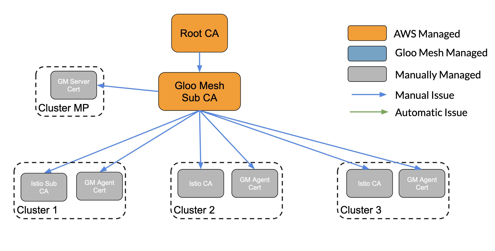
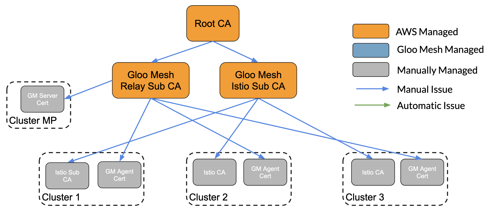
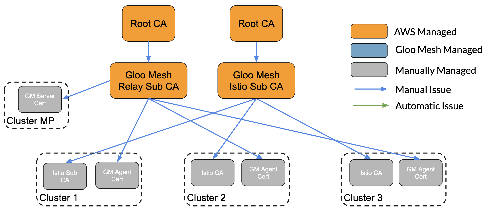

# Without Gloo Mesh Management

This approach describes how you will need to manage certificates if you do not with to usilize Gloo Mesh to issue certificates or manage Istio CA certificates. It is recommended that if you utilize this approach you add some sort of automation so that the certificates can be rotated easily in the future. You have a couple of options.

## Single Intermediate CA

If you favor simplicity over complexity, you can issue a single Intermedite CA within ACM and issue certificates from it. 

## Relay Intermediate CA and Istio Issuing Intermediate CA
Another approach is to separate out the two responsibilities to their own Intermediate CA Certificates. 

## Multi-Root Multi-Intermediate CA
If security is your top concern you can create separate Root Certificates for your Intermediate CAs. This allows the communication between relays to have no commonality between the communication of your mesh applications. 

